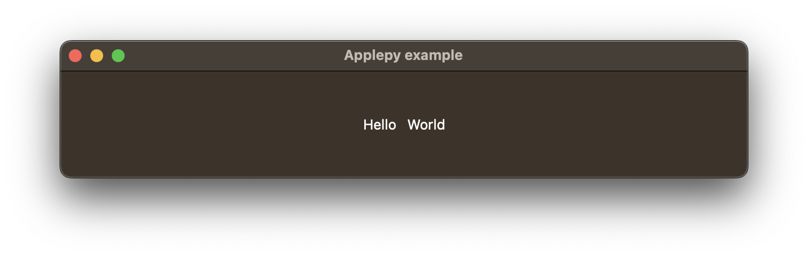

# applepy

Applepy is a UI library inspired by Swift UI that leverages AppKit and UIKit (soon) to create native MacOS, iOS and iPadOS user interfaces in the Python programming language with a declarative syntax.

*This project is at proof of concept stage and is not feature complete. Please do not use it in production.* 

## Dependencies

* [rubicon-objc](https://github.com/beeware/rubicon-objc)
* [pydispatcher](https://github.com/mcfletch/pydispatcher)

## Installation

The latest version is available for installation in PyPI:
>pip install applepy-ui

## Usage

```python
class Sample(App):
    def body(self) -> Scene:
        with Window(title='Applepy example', size=Size(640, 100)) as w:
            with VerticalStack():
                with HorizontalStack():
                    Label(text='Hello')
                    Label(text='World')
                
            return w.center()
Sample().run()
```



For a more complete example, please check [example.py](example.py)